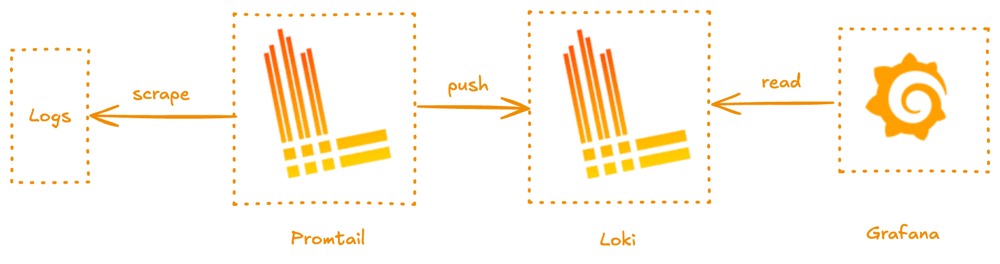
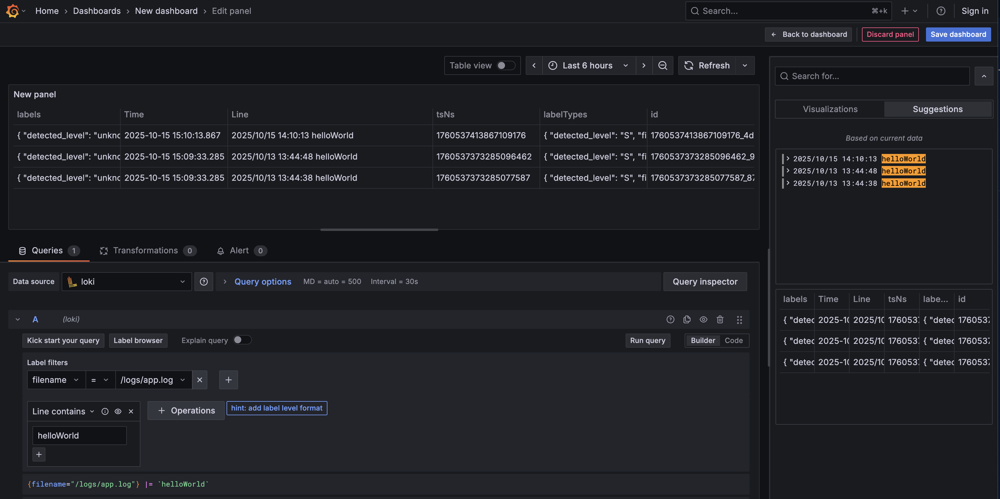

# Go Echo App with Loki and Grafana

A sample Go application using [Echo](https://echo.labstack.com/) framework with [Loki](https://grafana.com/oss/loki/) for log aggregation and Grafana for visualization.



## Prerequisites

- Docker
- Docker Compose

## Setup

```bash
docker-compose up --build
```

## Endpoints

- `GET /` - Hello World (JSON)
- `GET /health` - Health check (JSON)
- `GET /external` - External API call with latency tracking

## Services

- **App**: `http://localhost:8000`
- **Grafana**: `http://localhost:3000`
- **Loki**:`http://localhost:3100`

## Grafana Setup

1. Open `http://localhost:3000`
2. Go to Configuration > Data Sources
3. Add Loki with URL: `http://loki:3100`
4. Explore logs with query: "{filename="/logs/app.log"} |=`helloWorld`"



## Clean Up

```bash
docker-compose down
```